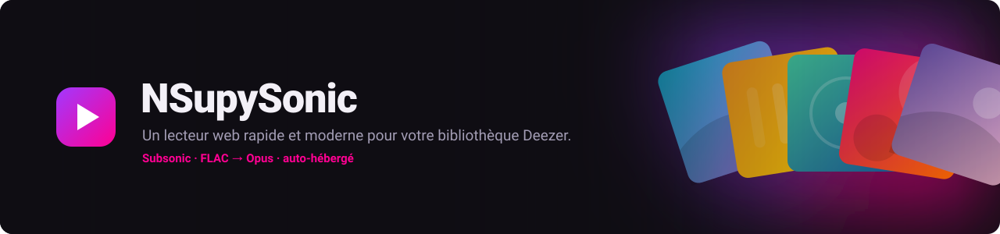
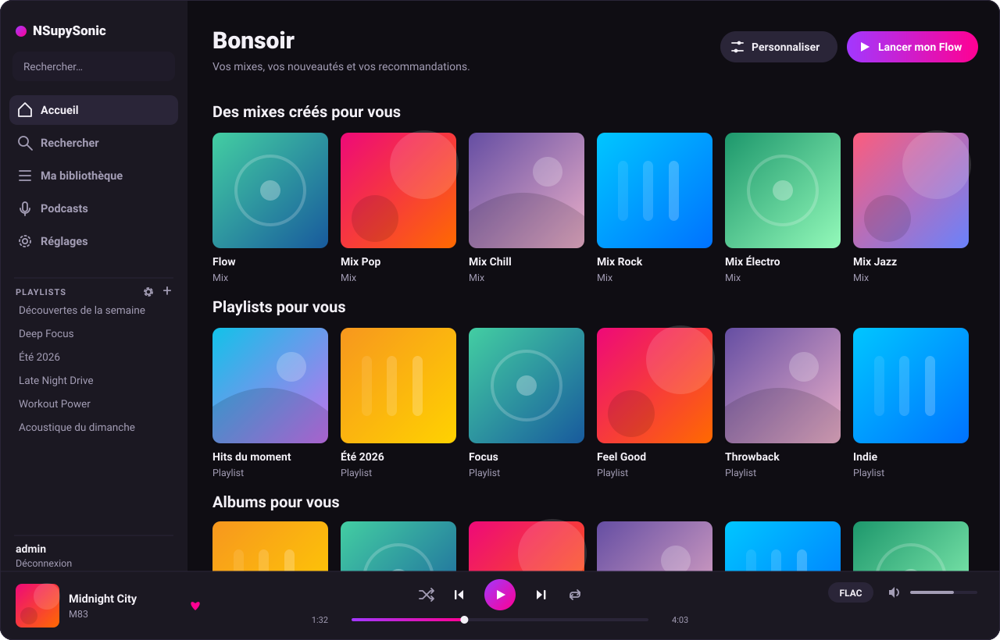
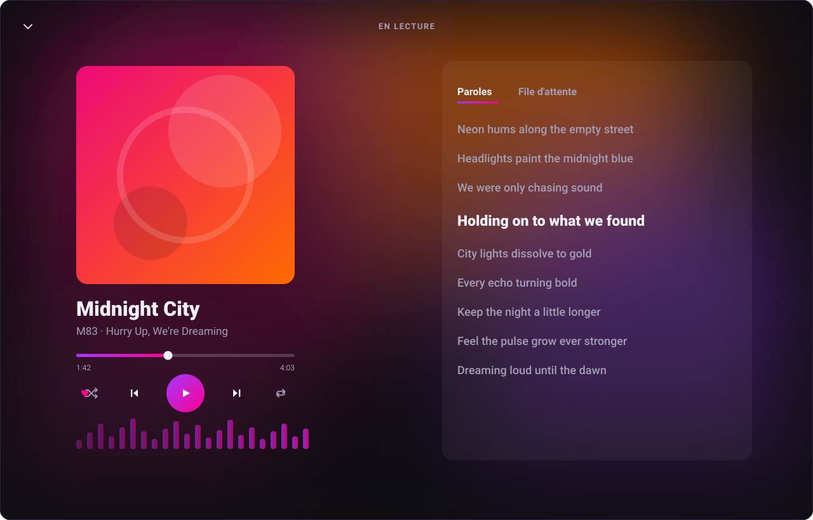

<div align="center">



**A fast, modern web player for your Deezer library — backed by a self-hosted Subsonic server.**

Deezer playlists, favorites, Flow and new releases as native library entries in a snappy
Svelte web player *and* any Subsonic client. Tracks are fetched in **FLAC**, archived once,
and **transcoded to Opus** on demand.

[](https://github.com/fnyaker/NSupySonic/pkgs/container/nsupysonic)
[](https://github.com/fnyaker/NSupySonic/actions/workflows/docker.yaml)
[](https://github.com/fnyaker/NSupySonic/actions/workflows/tests.yaml)


[Quick start](#-quick-start-with-ghcr) · [Screenshots](#screenshots) · [Features](#features) · [Configuration](#configuration) · [Android](#android-app)

</div>

---

NSupySonic (**N**yaker's **Supysonic**) is a fork of [supysonic][] wired to Deezer. The headline
is the **web player**: a custom single-page app that makes your Deezer library feel quick and
pleasant to browse — the part most people are actually here for, since Deezer's own web client is
sluggish and clumsy. Because it's built on a full [Subsonic][] API server, that same library (and
any local files) is also available in any Subsonic app — you get a great browser experience *and*
native mobile/desktop clients, from one server.

> [!NOTE]
> For personal use with your own Deezer account. FLAC requires a Deezer HiFi/Premium
> subscription. Respect Deezer's Terms of Service.

## Screenshots

<div align="center">



<em>Home — card-based, fast: your mixes, recommended playlists and albums, with Flow one tap away.</em>

<br><br>



<em>Immersive now-playing — big art, a color backdrop pulled from the cover, synced lyrics and a live visualizer.</em>

</div>

## 🚀 Quick start with GHCR

Every push to `master` publishes a **prebuilt, multi-arch (amd64 + arm64) image** to the GitHub
Container Registry: **`ghcr.io/fnyaker/nsupysonic:latest`**. It's public — nothing to log into — so
you can be up and running in one command, no clone and no build.

**Requirements:** Docker, a Deezer account (HiFi/Premium for FLAC), and your Deezer `arl` cookie
([how to get it](#getting-your-arl)).

### Option A — one `docker run`

```sh
docker run -d --name nsupysonic -p 5722:5722 \
  -e SUPYSONIC_ADMIN_PASSWORD=change-me \
  -e DEEZER_ARL=your_arl_cookie \
  -e DEEZER_SYNC_USER=admin \
  -v nsupysonic-data:/data \
  ghcr.io/fnyaker/nsupysonic:latest
```

### Option B — Docker Compose (recommended)

```sh
git clone https://github.com/fnyaker/NSupySonic.git
cd NSupySonic
cp .env.example .env          # edit: set SUPYSONIC_ADMIN_PASSWORD and DEEZER_ARL
docker compose up -d          # pulls ghcr.io/fnyaker/nsupysonic:latest — no build
```

Then open:

| | |
| --- | --- |
| 🎧 **Web player** | <http://localhost:5722/app> |
| 📡 **Subsonic API** | point any Subsonic client at <http://localhost:5722/rest> |
| ⚙️ **Admin UI** | <http://localhost:5722/> |

Log in with the admin user from your `.env` (created automatically on first boot). A first Deezer
sync runs ~20 s after startup; your playlists, favorites and new releases appear shortly after.

> [!TIP]
> **Update** any time with `docker compose pull && docker compose up -d` (or, for `docker run`,
> `docker pull ghcr.io/fnyaker/nsupysonic:latest` then recreate the container). Persistent state —
> the database, caches and the Deezer FLAC archive — lives in the `nsupysonic-data` volume and
> survives updates. Pin a specific build with `ghcr.io/fnyaker/nsupysonic:<sha>` if you prefer.

### Deploy with Portainer

In Portainer a deployment is a **Stack**. The image is public, so there's nothing to authenticate —
you don't even need the repo or an `.env` file. Just paste a stack and set the variables in the UI.

1. **Stacks → Add stack**, name it (e.g. `nsupysonic`), and paste this into the **Web editor**:

   ```yaml
   services:
     supysonic:
       image: ghcr.io/fnyaker/nsupysonic:latest
       container_name: nsupysonic
       restart: unless-stopped
       ports:
         - "5722:5722"
       environment:
         SUPYSONIC_ADMIN_USER: ${SUPYSONIC_ADMIN_USER:-admin}
         SUPYSONIC_ADMIN_PASSWORD: ${SUPYSONIC_ADMIN_PASSWORD}
         DEEZER_ARL: ${DEEZER_ARL}
         DEEZER_SYNC_USER: ${SUPYSONIC_ADMIN_USER:-admin}
         DEEZER_QUALITY: ${DEEZER_QUALITY:-FLAC}
       volumes:
         - nsupysonic-data:/data
         # Optional existing local library (hybrid with Deezer):
         # - /host/path/to/music:/data/music:ro
   volumes:
     nsupysonic-data:
   ```

2. Under **Environment variables**, add at least `SUPYSONIC_ADMIN_PASSWORD` (a password you choose)
   and `DEEZER_ARL` (your `arl` cookie, [below](#getting-your-arl)). Optionally
   `SUPYSONIC_ADMIN_USER` (default `admin`) and `DEEZER_QUALITY`.

3. **Deploy the stack.** Open `http://<host>:5722/app` and log in. To update later: open the stack →
   **Pull and redeploy** (tick *re-pull image*).

### Building the image locally instead

To run un-released changes, build from source — edit `docker-compose.yml` (comment the `image:`
line, uncomment `build: .`) then `docker compose up -d --build`. The build also compiles the Svelte
web UI and bundles it into the image, so there are no extra steps.

## Features

- **A web player that's actually fast** at `/app` — a custom Svelte single-page app: card-based
  home, search, artist / album / playlist pages, a real queue, synced lyrics, an immersive
  full-screen now-playing view with a visualizer, gapless quality switching, and Flow. The quick,
  clean Deezer front-end you wish Deezer shipped.
- **Deezer in your Subsonic client too** — your playlists (created *and* favorited), favorites,
  *Nouveautés* / *Découverte* and charts appear as native library entries. Works with any Subsonic
  app (Symfonium, DSub, play:Sub, Tempo, …).
- **Archive once, keep forever** — the first time a track is played it's fetched in FLAC from
  Deezer, decrypted, tagged and stored under `archive_dir`. Every later play is served from disk.
- **FLAC + Opus, everywhere** — tracks are *always* archived as FLAC and transcoded to **Opus
  (320 / 128 / 64)** on the fly. The web player has a quality menu; Subsonic clients get the
  original FLAC when they request lossless, or Opus at the bitrate they ask for.
- **Podcasts** — subscribe to Deezer shows and play episodes; they get their own pages in the web
  player and appear through the Subsonic podcast endpoints.
- **Two-way sync** — Deezer → your library on a schedule; starring a track or creating/editing a
  playlist in your client is mirrored back to your Deezer account.
- **Fully automatic** — a full sync runs on startup and then daily (04:00 by default). No cron, no
  manual command.
- **Customizable Flow** — enable or disable genre/style clusters from the web UI (Deezer's GraphQL
  Flow tuner).
- **Hybrid library** — your existing local music sits alongside Deezer; the normal supysonic
  browsing/scanning still works.
- **Download ahead** — pre-archive a whole playlist or album in one click, without waiting for
  playback.
- **PostgreSQL out of the box** — `docker compose up` starts a bundled Postgres alongside the app;
  any legacy SQLite data on the volume is migrated across automatically on the next boot.

## How it works

Deezer entities are imported as ordinary library rows under a dedicated `Deezer` root folder, so
supysonic's normal browse / search / playlist / star endpoints work **unchanged**. Only streaming
is intercepted: on first play the FLAC is fetched from Deezer, decrypted (Blowfish-CBC stripe
cipher), archived, tagged and served; lower qualities are produced by the transcoder and cached.
Upcoming tracks of the current album/playlist are pre-fetched in the background.

This means the same data powers your Subsonic client and the web player — there is no separate
"Deezer mode", it's just your library.

## Podcasts

Deezer *shows* are subscribable channels and their *episodes* stream like any other track. In the
web player, **Podcasts** has its own grid and per-show episode list; in Subsonic clients they show
up through the standard podcast endpoints (`getPodcasts`, `getNewestPodcasts`, …). Unlike music,
episodes are plain MP3 straight from the podcast host (no FLAC/Opus pipeline) and are archived under
`archive_dir/Podcasts/<Show>/` on first play.

## Configuration

There are two ways to configure the server; pick one.

**1. Environment variables** (simplest — edit `.env`, or pass `-e` flags to `docker run`):

| Variable                   | Default    | Description                                                       |
| -------------------------- | ---------- | ---------------------------------------------------------------- |
| `SUPYSONIC_ADMIN_USER`     | `admin`    | Admin/login user, created on first boot.                         |
| `SUPYSONIC_ADMIN_PASSWORD` | `changeme` | **Change this.** Admin password.                                 |
| `DEEZER_ARL`               | *(empty)*  | Your Deezer ARL cookie. Empty = run without Deezer.              |
| `DEEZER_SYNC_USER`         | `admin`    | User the auto-sync writes to (compose sets it to the admin).     |
| `DEEZER_QUALITY`           | `FLAC`     | Archive quality (`FLAC` recommended; needs HiFi).                |
| `DEEZER_SYNC_AT`           | `04:00`    | Daily auto-sync time (HH:MM).                                    |
| `DEEZER_REPORT_LISTENS`    | *(off)*    | Report plays back to Deezer so recommendations/Flow keep learning. Set `yes` to enable. |
| `ANDROID_VERSION_NAME`     | *(image release)* | Android app version clients should run; older ones are offered the update at startup. Empty = never claim one. |
| `ANDROID_DOWNLOAD_URL`     | *(releases page)* | Where that update is downloaded from.                    |
| `DATABASE_URI`             | *(bundled Postgres)* | Empty = the bundled `db` Postgres service. Set a URI to point at an external database. |

Advanced knobs (web-server concurrency `GUNICORN_THREADS` / `GUNICORN_TIMEOUT`, reverse-proxy
hardening `SUPYSONIC_PROXY_HOPS` / `SUPYSONIC_SESSION_COOKIE_SECURE`, and the bundled `POSTGRES_PASSWORD`)
are documented inline in [`.env.example`](.env.example) and [`docker-compose.yml`](docker-compose.yml).

**2. A mounted config file** (full control — sync options, smart tracklists, transcoders,
Postgres, …): copy `config/supysonic.conf.example` to `config/supysonic.conf`, edit it, and
uncomment the volume line in `docker-compose.yml`. That file is gitignored because it holds your ARL.

The full set of options (with comments) lives in [`config.sample`](config.sample) and
[`config/supysonic.conf.example`](config/supysonic.conf.example).

### Getting your ARL

The ARL is the session cookie that authenticates you with Deezer:

1. Log in at <https://www.deezer.com> in your browser.
2. Open the developer tools → **Application** (or **Storage**) → **Cookies** →
   `https://www.deezer.com`.
3. Copy the value of the cookie named **`arl`** into `DEEZER_ARL`.

An ARL expires every few months. When it does you don't have to edit any file: the web player tells
you (a banner, and the state is shown in **Réglages → Compte**), and an admin can paste a new one
right there. It is verified against Deezer before being saved, stored in the database, **overrides
`DEEZER_ARL` / the config file**, and takes effect immediately — no restart. The value is never
displayed again, only its last four characters.

> [!WARNING]
> **Treat the ARL like a password.** It grants full access to your Deezer account. Never commit it
> or share it. `.env`, `config/supysonic.conf` and `*.har` captures are gitignored and excluded
> from the Docker build context for exactly this reason.

### PostgreSQL

Postgres is the default: `docker compose up` starts a bundled `db` service alongside the app and the
app connects to it out of the box. The only thing to set is `POSTGRES_PASSWORD` in `.env` (single
source of truth — the `DATABASE_URI` reuses it). To use an external Postgres instead, remove the `db`
service from `docker-compose.yml` and point `DATABASE_URI` at your server in `.env`. If a legacy
SQLite database is still on the `/data` volume, its data is migrated across automatically on the next
boot, one-shot and transparent.

## Streaming quality

The rule: **always archive FLAC, transcode to Opus.** Deezer audio is never streamed as MP3
directly.

- **Web player** — a quality menu cycles **FLAC · Opus 320 · Opus 128 · Opus 64**. The archived
  FLAC is transcoded with `ffmpeg`/`libopus` through supysonic's transcode cache (so repeats are
  cached and seekable).
- **Subsonic clients** — request *lossless* to get the original FLAC, or set a max bitrate (e.g.
  320 / 128 / 64) to receive Opus at that rate. This is the standard `default_transcode_target =
  opus` + `transcoder_flac_opus` setup, already configured in the image.

## Auto-sync

When a `sync_user` is set (compose sets it to the admin), a full sync runs **on startup** and then
**daily** at `sync_at` (default 04:00) — or every `sync_interval` minutes if you prefer. It
refreshes your playlists, favorites and the *Nouveautés* / *Découverte* smart-tracklist playlists.
No cron or `supysonic-cli deezer sync` needed.

## Flow customization

Open the web player, go to the home page and click **Personnaliser** on the Flow card. You get
Deezer's genre/style clusters as tiles — enable the ones you want in your Flow, disable the rest,
and save. (Uses Deezer's GraphQL Flow tuner; requires an account where Flow customization is
available.)

## Android app

A native Kotlin app (`android/`) wraps the web player in a fullscreen WebView and adds what a mobile
browser can't provide: a **foreground media service + MediaSession**, so playback survives long
pauses in the background and gets real lockscreen / notification / Bluetooth controls. On first
launch you enter your server URL, an optional port, and whether to verify the SSL certificate
(untick for self-signed setups).

The APK is built by CI (`android.yaml` workflow) alongside the Docker image: grab the
`nsupysonic-apk` artifact from any run, or the APK attached to releases on `v*` tags. See
[android/README.md](android/README.md) for details (including stable-signature setup via repo
secrets).

**Update notice.** At startup — and only then — the web player compares the installed app's version
with the one the server publishes ([webapp] `android_version`, set automatically from the release tag
in the official image, or via `ANDROID_VERSION_NAME`) and offers the download when the app is older.
A server that declares no version never claims an update exists.

### Web app updates

The SPA is a real install: the service worker serves the shell from disk, so a launch is instant
whether you're online, offline or on a terrible link. Freshness comes from an explicit version check
instead of a network race — the running app knows its own build id and asks the server
(`/app/version.json`) which build it serves. When they differ the new build is downloaded **in full,
in the background**, and only then does the app swap to it: automatically if you've just opened it,
otherwise with a "Nouvelle version prête" notice so it never yanks the page away mid-song. An
interrupted download changes nothing — the previous, complete build stays in place.

## Running without Docker

NSupySonic is a normal Python package (3.10+).

```sh
pip install .
pip install gunicorn

# create the admin user
supysonic-cli user add MyUser -p MyPassword
supysonic-cli user setroles MyUser -A

# add a [deezer] section to your config (see config.sample), then:
supysonic-cli deezer login-test            # check the ARL works
supysonic-cli deezer import <deezer-url>   # import a track / album / playlist
supysonic-cli deezer sync                  # import playlists / favorites / new releases

# build the web UI (optional; the Docker image does this for you)
cd webapp && npm install && npm run build && cd ..

supysonic-server                           # serves on :5722
```

## Development

```sh
# Python tests (no network required)
python -m unittest                    # whole suite
python -m unittest tests.test_deezer  # one module

# Web UI dev server (hot reload; proxies /api -> localhost:5000)
cd webapp && npm install && npm run dev
```

The Flask development server is handy for the backend:

```sh
export FLASK_APP="supysonic.web:create_application()"
flask run
```

## Project layout

```
deezerpy/             Deezer client (private gateway + public API + GraphQL), based on deezer-py
supysonic/deezer/     The proxy: provider, archive, importer, prefetch, scheduler, push
supysonic/webui/      The custom /api blueprint + the bundled SPA server (/app)
webapp/               The Svelte single-page web player (built into supysonic/webui/dist)
android/              Native Kotlin WebView wrapper (foreground media service + MediaSession)
docker/               Entrypoint + baked default config
docs/screenshots/     README artwork
```

## Security & privacy

- Your **ARL** lives only in `.env` or `config/supysonic.conf`, both gitignored; the Docker build
  context excludes them too.
- All custom `/api` routes require a logged-in session; session cookies are `HttpOnly` +
  `SameSite=Lax` (set `SUPYSONIC_SESSION_COOKIE_SECURE=yes` behind HTTPS).
- API exploration captures (`*.har`) contain real session tokens and are gitignored — never commit
  them.
- This is meant for **personal use** with your own account.

## Credits

- [supysonic][] by Louis-Philippe Véronneau / Alban Féron — the Subsonic server this is built on
  (AGPL-3.0).
- [deezer-py][] by RemixDev — the basis for the bundled Deezer client.

## License

Distributed under the terms of the **GNU AGPL-3.0-only** license, inherited from supysonic. See
[LICENSE](LICENSE).

<sub>Screenshots are representative mockups of the web player; cover artwork shown is illustrative,
not real album art.</sub>

[subsonic]: http://www.subsonic.org/
[supysonic]: https://github.com/spl0k/supysonic
[deezer-py]: https://gitlab.com/RemixDev/deezer-py
</content>
</invoke>
