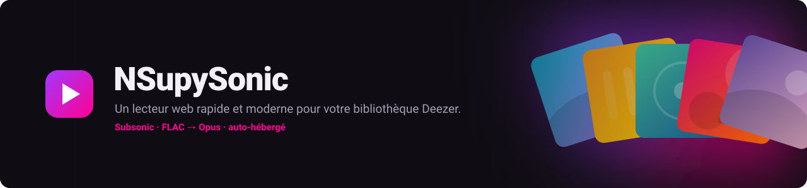
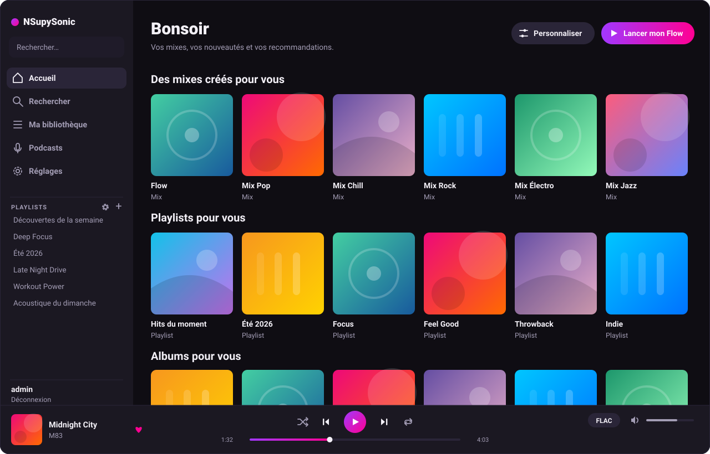
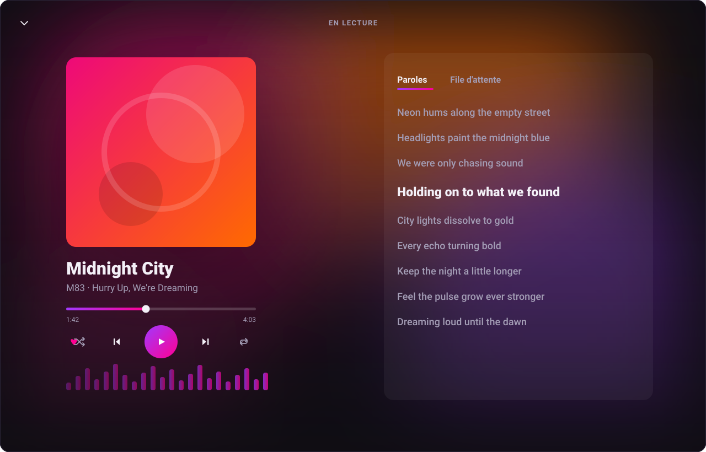

<div align="center">



**Your Deezer library as a self-hosted music app — lossless, offline-first, and yours to keep.**

A fast web player (and an Android app) for your Deezer account. Every track you play is fetched
once in **FLAC**, archived on your own disk and served from there forever, transcoded to **Opus**
on demand. Playlists, favourites, Flow, podcasts and new releases are all there — and nothing
stops working the day Deezer does.

[](https://github.com/fnyaker/NSupySonic/pkgs/container/nsupysonic)
[](https://github.com/fnyaker/NSupySonic/actions/workflows/docker.yaml)
[](https://github.com/fnyaker/NSupySonic/actions/workflows/tests.yaml)
[](https://github.com/fnyaker/NSupySonic/actions/workflows/webapp.yaml)


[Quick start](#quick-start) · [What it does](#what-it-does) · [Configuration](#configuration) · [Android](#android-app) · [Development](#development) · [Roadmap](todo.md)

</div>

---

NSupySonic (**N**yaker's **Supysonic**) started as a fork of [supysonic][], a Python Subsonic
server, and has become a music app of its own: a **Svelte web player at `/app`**, a native
**Android app**, and a **Deezer proxy** underneath that turns your account into an ordinary library
on your disk. The server still speaks the Subsonic API at `/rest`, so any Subsonic client can play
the same library — but that is a side door now, not the point.

The interface is in French.

> [!NOTE]
> For personal use with your own Deezer account. FLAC needs a Deezer HiFi / Premium subscription.
> Respect Deezer's Terms of Service.

## Screenshots

<div align="center">



<em>Home — mixes, playlists, albums and artists picked for you, with Flow one tap away.</em>

<br><br>



<em>Full-screen player — a backdrop pulled from the cover, synced lyrics, and an animation that plays to the music.</em>

</div>

<sub>Screenshots are representative mockups; the artwork is illustrative, not real album art.</sub>

## Quick start

Every push to `master` publishes a prebuilt multi-arch (amd64 + arm64) image to the GitHub
Container Registry: **`ghcr.io/fnyaker/nsupysonic:latest`**. It is public — nothing to log into.

**You need:** Docker, a Deezer account, and your Deezer `arl` cookie ([how to get it](#getting-your-arl)).

### Docker Compose (recommended)

```sh
git clone https://github.com/fnyaker/NSupySonic.git
cd NSupySonic
cp .env.example .env          # set SUPYSONIC_ADMIN_PASSWORD and DEEZER_ARL
docker compose up -d          # pulls the image, starts the app and its PostgreSQL
```

### One `docker run`

```sh
docker run -d --name nsupysonic -p 5722:5722 \
  -e SUPYSONIC_ADMIN_PASSWORD=change-me \
  -e DEEZER_ARL=your_arl_cookie \
  -e DEEZER_SYNC_USER=admin \
  -e DATABASE_URI=sqlite:////data/supysonic.db \
  -v nsupysonic-data:/data \
  ghcr.io/fnyaker/nsupysonic:latest
```

The image's built-in default points at the compose file's PostgreSQL service, so a standalone
`docker run` needs a `DATABASE_URI` — SQLite on the volume, as above, is fine to try it out.

### Then open

| | |
| --- | --- |
| **Web player** | <http://localhost:5722/app> |
| **Subsonic API** | <http://localhost:5722/rest> — for any Subsonic client |
| **Admin pages** | <http://localhost:5722/> |

Log in with the admin user from your `.env` (created on first boot). A first Deezer sync starts
about 20 seconds after startup; your playlists, favourites and new releases show up shortly after.
The web player installs like an app on a phone or a desktop (*Add to home screen*).

> [!TIP]
> **Update** with `docker compose pull && docker compose up -d`. Everything that matters — the
> database, the caches and the FLAC archive — lives in volumes and survives updates.

<details>
<summary><strong>Deploy with Portainer</strong></summary>

In Portainer a deployment is a **Stack**. The image is public, so there is nothing to authenticate.

1. **Stacks → Add stack**, name it `nsupysonic`, and paste this into the web editor:

   ```yaml
   services:
     supysonic:
       image: ghcr.io/fnyaker/nsupysonic:latest
       container_name: nsupysonic
       restart: unless-stopped
       ports:
         - "5722:5722"
       environment:
         SUPYSONIC_ADMIN_USER: ${SUPYSONIC_ADMIN_USER:-admin}
         SUPYSONIC_ADMIN_PASSWORD: ${SUPYSONIC_ADMIN_PASSWORD}
         DEEZER_ARL: ${DEEZER_ARL}
         DEEZER_SYNC_USER: ${SUPYSONIC_ADMIN_USER:-admin}
         DEEZER_QUALITY: ${DEEZER_QUALITY:-FLAC}
       volumes:
         - nsupysonic-data:/data
   volumes:
     nsupysonic-data:
   ```

2. Under **Environment variables**, add `SUPYSONIC_ADMIN_PASSWORD` and `DEEZER_ARL`.
3. **Deploy the stack.** To update later: open the stack → **Pull and redeploy** (re-pull the image).

</details>

<details>
<summary><strong>Build the image yourself</strong></summary>

In `docker-compose.yml`, comment the `image:` line and uncomment `build: .`, then
`docker compose up -d --build`. The build compiles the Rust analysers to WebAssembly, builds the
Svelte app and bundles both into the image.

</details>

## What it does

### The core idea: archive FLAC once, transcode to Opus

Deezer tracks are never streamed straight from Deezer. The first time you play one, the FLAC is
fetched, decrypted, tagged (with its cover, its lyrics and a small metadata sidecar) and stored under
`archive_dir`. Every later play comes from your disk. Lower qualities are produced from that FLAC by
`ffmpeg` (Opus 320 / 128 / 64) and cached; the web player has a quality menu, and Subsonic clients
get FLAC when they ask for lossless or Opus at the bitrate they request.

An archived track carries its whole identity with it — audio, cover, lyrics, tags and Deezer's ids
and credits — so it stays playable, findable and complete whatever happens to your Deezer account.

**Archiving is event-driven.** A track is archived when it becomes yours: you play it, star it,
favourite its album, playlist or artist (the whole discography), add it to a playlist, or subscribe
to a show. Priorities are strict — a person waiting to hear a track always jumps ahead of
background downloads. Archive rules in **Réglages → Archive** decide which events archive what, and
an optional, off-by-default cleanup can free space (never touching favourites or playlists unless you
allow it, and never touching uploads).

### Deezer is optional to the app running

Playing archived music, browsing, playlists, favourites, uploads and the app itself keep working at
full speed while Deezer is unreachable. The parts that need Deezer fail fast, without a verdict about
your data: a network error never marks a track as gone. If your `arl` dies, the app says so and you
paste a new one in **Réglages → Compte** — no restart. A track Deezer really removed is flagged, and
you can replace it, upload your own copy, or delete it.

### The web player

A single-page app built for speed, at `/app`:

- **Home, search, artist / album / playlist pages**, a real queue, and a library with favourites,
  playlists, downloads and your own files. Long lists are windowed, so a 4 000-track favourites page
  scrolls and filters instantly, and accents don't get in the way (*beyonce* finds *Beyoncé*).
- **Two-way Deezer sync**: your playlists, favourites, Flow and new releases come in on a schedule
  (on startup, then daily); starring a track or editing a playlist here is mirrored back to your
  account.
- **Flow and mixes**, with **customizable Flow clusters**, track and artist radio, and an endless
  queue you can reorder by dragging and clear in one tap.
- **Explore**: what is charting worldwide, by genre and by country, and the new releases.
- **Under the full-screen player**, swipe up for tracks that sound like the one playing and the
  artist behind it.
- **Sleep timer** (minutes, or the end of the track, with a fade-out) and **podcast speed**
  remembered per show.
- **Synced lyrics** in the full-screen player, from Deezer first and [LRCLIB](https://lrclib.net)
  after, archived beside the audio.
- **Podcasts** — subscribe to Deezer shows; episodes are archived on first play, positions are saved
  on the server and synced with Deezer, and you can drop markers in an episode.
- **Sharing** — send the whole file or an excerpt you select on a zoomable waveform.
- **Bulk export** of a playlist, an album or your favourites as one streamed ZIP, in the format you
  choose.
- **Uploads** of your own files next to your Deezer library.
- **Back goes to the screen, not just the route**: coming back from an album returns you to your
  search, scroll position included.
- **Offline and instant**: the app shell is served from a service worker, downloads and covers live
  on the device, and updates are staged in full in the background before the app swaps to them.

### Sound

- **Crossfade** with **silence trimming**, so the gap between tracks is really gone — and it never
  starts a download just to look at the next track.
- **Volume normalization** (ReplayGain) applied per track and preloaded, never changed under a
  playing song.
- **10-band equalizer** with presets of your own, bass enhancement.
- An output **latency model** (Bluetooth, TV, receiver) shared by the animations, the lyrics and the
  listen party, with one per-device offset for what no API reports.
- A **direct output** for when the browser's audio processor chops the sound (it can, on an Android
  Bluetooth link to a car radio): the player measures the music's pace, and the moment it goes wrong
  it plays straight to the system's media output instead — for that connection, retried later and
  forgotten once clean. The animations keep running on a copy of the sound. Or pin it on in Réglages.

### Animations

Full-screen animations that play to the music, drawn as WebGL2 shaders: **50 worlds** on eleven
shelves (hard dance, techno, trance, urban, rock, calm, retro…), an oscilloscope, and a **projector
window** (`#/viz`) you drag onto a beamer while the music plays in another tab. The analysis runs in
Rust compiled to WebAssembly, on the audio thread: kick, beat, bar and drop detection, tempo, and a
genre reading. The genre picks the world, so a frenchcore drop and a jazz trio don't look alike.
Everything degrades gracefully — pick a lighter tier, or **eco mode** to switch every animation off.
Flashing has a photosensitivity guard, and `prefers-reduced-motion` always wins.

### Genre analysis and the genre studio

The server measures each archived track once — tempo (Deezer's own where it has one, measured from the
file otherwise), spectral descriptors, loudness range — and serves a verdict the player uses to lock
its beat grid immediately. On top of that, the **genre studio** teaches it *your* genres: you tag a
few hundred tracks by confirming guesses with the keyboard, a small model trains in your browser
(in Rust/WebAssembly, in a worker), and the server applies it to the whole library. It needs an
optional audio feature extractor you supply yourself; without it the built-in classifier keeps
working.

### Listen party

Share a link or a QR code and anyone who opens it hears what you play at the same instant, to within
about a millisecond, on their own device — no account needed. In one room, every phone becomes
another speaker. Guests can only hear what you are playing.

### Remote control

Make a link on the device that plays, hand it over as a URL or QR code, and whoever opens it drives
that player from their own phone — in the same app, with the same screens. Four levels: queue only,
read-only browsing, everything but administration, or admin. You can see who is driving, cut one link
or all of them, and the links expire.

### Android app

A native Kotlin app that wraps the web player and adds what a browser can't: a foreground service and
media session for lockscreen, notification and Bluetooth controls, survival of long background stays,
and **Deezer sign-in from inside the app** (you log in on Deezer's own page; only the `arl` comes back,
never your password). See [Android app](#android-app).

### Subsonic, on the side

Deezer entities are stored as ordinary library rows, so any Subsonic client (Symfonium, DSub, Tempo,
play:Sub…) can browse, search and play the same library at `/rest`, with the same FLAC/Opus rules.
Local music can sit alongside it (mount a folder on `/data/music`).

## Configuration

Two ways; pick one.

**1. Environment variables** (simplest — `.env`, or `-e` flags):

| Variable | Default | Description |
| --- | --- | --- |
| `SUPYSONIC_ADMIN_USER` | `admin` | Admin / login user, created on first boot. |
| `SUPYSONIC_ADMIN_PASSWORD` | `changeme` | **Change this.** |
| `DEEZER_ARL` | *(empty)* | Your Deezer `arl` cookie. Empty = run without Deezer. |
| `DEEZER_SYNC_USER` | `admin` | The user auto-sync writes to (compose sets it to the admin). |
| `DEEZER_QUALITY` | `FLAC` | Archive quality. Keep `FLAC`. |
| `DEEZER_SYNC_AT` | `04:00` | Daily sync time (HH:MM). |
| `DEEZER_REPORT_LISTENS` | *(off)* | `yes` reports your plays to Deezer so Flow and recommendations keep learning. |
| `DATABASE_URI` | *(bundled PostgreSQL)* | Point at an external database. |
| `ANDROID_VERSION_NAME` | *(image release)* | The Android version clients should run; older ones are offered the update. |
| `ANDROID_DOWNLOAD_URL` | *(releases page)* | Where that update is downloaded from. |

Also available: `POSTGRES_PASSWORD` (the bundled database), `GUNICORN_THREADS` / `GUNICORN_TIMEOUT`
(concurrency), and `SUPYSONIC_PROXY_HOPS` / `SUPYSONIC_SESSION_COOKIE_SECURE` (behind a reverse
proxy and HTTPS). They are documented inline in [`.env.example`](.env.example) and
[`docker-compose.yml`](docker-compose.yml).

**2. A mounted config file**, for full control (sync options, transcoders, archive paths…): copy
`config/supysonic.conf.example` to `config/supysonic.conf`, edit it, and uncomment the volume line in
`docker-compose.yml`. The full annotated option set is in [`config.sample`](config.sample). The file
is gitignored because it holds your `arl`.

Most day-to-day settings — archive rules, cleanup, quality, downloads, the `arl` itself — are in
**Réglages** in the app, and take effect without a restart.

### Getting your ARL

The `arl` is the session cookie that authenticates you with Deezer.

1. Log in at <https://www.deezer.com> in your browser.
2. Open the developer tools → **Application** (or **Storage**) → **Cookies** → `https://www.deezer.com`.
3. Copy the value of the cookie named **`arl`**.

On Android you can skip this: **Réglages → Compte Deezer** opens Deezer's own login page inside the app
and picks the cookie up for you.

An `arl` expires every few months. When it does, the app tells you and an admin pastes a new one in
**Réglages → Compte**; it is verified against Deezer before being saved, overrides `DEEZER_ARL`, and
applies immediately.

> [!WARNING]
> **Treat the `arl` like a password.** It grants full access to your Deezer account. Never commit it
> or share it. `.env`, `config/supysonic.conf` and `*.har` captures are gitignored and excluded from
> the Docker build context for exactly this reason.

### Database

PostgreSQL is the default: `docker compose up` starts a bundled `db` service and the app connects to
it. To use an external one, remove the `db` service and set `DATABASE_URI`. SQLite and MySQL are also
supported by the code. A legacy SQLite database found on the data volume is migrated to PostgreSQL
automatically on the next boot.

## Android app

`android/` is a native Kotlin app: a fullscreen WebView hosts the player from your server, while a
foreground service keeps the process alive and owns the media notification, lockscreen and Bluetooth
controls. Audio stays in the WebView, so the app behaves exactly like the web player and works with
any server version.

On first launch you enter your server URL, an optional port, and whether to verify the SSL certificate
(untick for self-signed setups). If Android kills the WebView while the app is in the background, it is
rebuilt when you come back and resumes on the same track at the same position.

The APK is built by CI: take the `nsupysonic-apk` artifact from any run, or the file attached to a
`v*` release. At startup — and only then — the app compares its version with the one your server
publishes and offers the download when it is older. Details, including stable signing keys, are in
[android/README.md](android/README.md).

## Running without Docker

NSupySonic is a Python package (3.10+) with a few runtime tools.

```sh
pip install .
pip install gunicorn

supysonic-cli user add MyUser -p MyPassword
supysonic-cli user setroles MyUser -A

# add a [deezer] section to your config (see config.sample), then:
supysonic-cli deezer login-test            # check the arl works
supysonic-cli deezer import <deezer-url>   # a track, album or playlist
supysonic-cli deezer sync                  # playlists, favourites, new releases

cd webapp && npm install && npm run build && cd ..   # the web player (Docker does this for you)

supysonic-server                           # serves on :5722
```

You need `ffmpeg` (with `libopus`) on the machine. Optional extras:
`pip install 'supysonic[embedding]'` adds the audio feature extractor's runtime for the genre studio.

Handy batch commands: `supysonic-cli deezer lyrics` (archive lyrics for what you already have),
`deezer analyze` (measure tempo and style), `deezer bpm-audit` (Deezer's published BPM against the
measured one), `deezer embed` (extract genre embeddings).

## Development

```sh
# Python tests (offline, mocked)
python -m unittest                        # whole suite
python tools/partest.py                   # the same suite across processes — what CI runs

# Web player
cd webapp && npm install
npm run dev                               # hot reload; proxies /api to localhost:5000
npm test                                  # the SPA suite (audio analysis, animations, party, remote…)
npm run build                             # -> supysonic/webui/dist

# The Rust crates behind the analyser, the app core and the genre trainer
cd webapp && npm run wasm                 # rebuilds all five committed .wasm binaries
```

The compiled `.wasm` files are committed so a checkout builds without a Rust toolchain; the tests fail
if one was not built from the sources beside it. The Flask development server is handy for the backend:

```sh
export FLASK_APP="supysonic.web:create_application()"; flask run
```

[CLAUDE.md](CLAUDE.md) is the long-form engineering guide — architecture, the rules each subsystem
learned the hard way, and the measurements behind them. [todo.md](todo.md) is the roadmap.

## Project layout

```
deezerpy/             The Deezer client: public API, private gateway, GraphQL (based on deezer-py)
supysonic/deezer/     The proxy: provider, archive, sync, prefetch, analysis, genre embeddings, cleanup
supysonic/webui/      The /api blueprint and the server for the bundled web player (/app)
supysonic/api/        The Subsonic API (/rest), with streaming intercepted for Deezer tracks
webapp/               The Svelte web player, plus the Rust crates compiled to WebAssembly
android/              The native Kotlin app
docker/               Entrypoint and baked default config
tools/                Parallel test runner, tempo evaluation, API performance bench
tests/                Python test suite
docs/                 Notes, plans and README artwork
```

## Security and privacy

- Your `arl` lives only in `.env`, `config/supysonic.conf` or the database. It is never shown again
  after saving (only its last four characters), and never written into a file that outlives the session.
- Every `/api` route requires a login. Party, remote-control and share links are capabilities: an
  unguessable id that opens only what its owner published, and nothing else.
- Sessions use `HttpOnly` + `SameSite=Lax` cookies; set `SUPYSONIC_SESSION_COOKIE_SECURE=yes` behind HTTPS.
- Podcast episodes come from third-party feeds, so their URLs are restricted to public http(s)
  addresses, and the connection is pinned to the address that was checked.
- `*.har` captures contain real session tokens and are gitignored — never commit them.

## Credits

- [supysonic][] by Louis-Philippe Véronneau and Alban Féron — the Subsonic server this began as (AGPL-3.0).
- [deezer-py][] by RemixDev — the basis of the bundled Deezer client.
- [LRCLIB](https://lrclib.net) for open synced lyrics.
- [beatsync](https://github.com/freeman-jiang/beatsync) — the model for the listen party's clock.

## License

Distributed under the **GNU AGPL-3.0-only** license, inherited from supysonic. See [LICENSE](LICENSE).

[subsonic]: http://www.subsonic.org/
[supysonic]: https://github.com/spl0k/supysonic
[deezer-py]: https://gitlab.com/RemixDev/deezer-py
